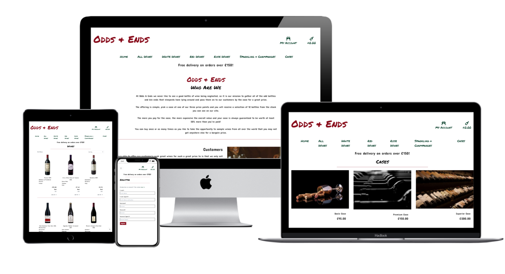
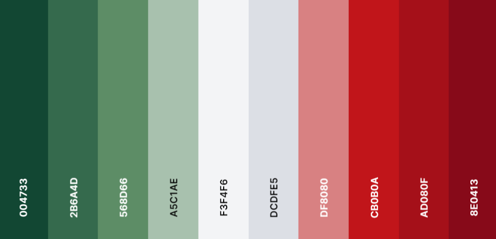
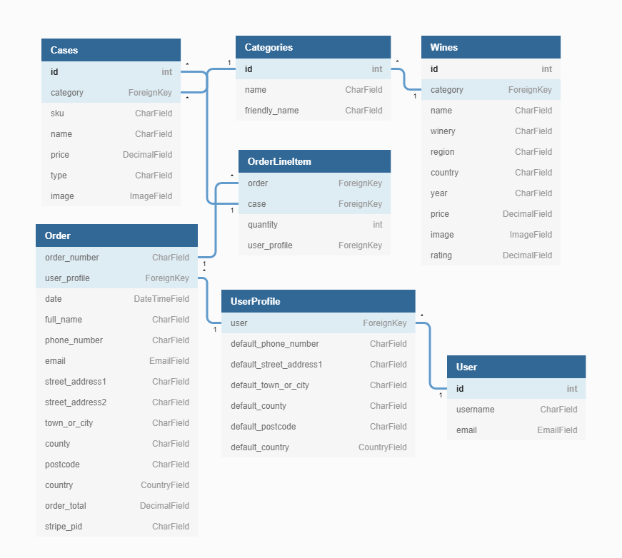

# Odds & Ends

At Odds & Ends we never like to see a good bottle of wine being neglected, so it is our mission to gather all of the odd bottles and bin ends that vineyards have lying around and pass them on to our customers by the case for a great price. The offering is simple, pick a case at one of our three price points and you will receive a selection of 12 bottles from the stock you can see on our site. The more you pay for the case, the more expensive the overall value and your case is always guaranteed to be worth at least 50% more than you’ve paid! You can buy once or as many times as you like to take the opportunity to sample wines from all over the world that you may not get anywhere else for a bargain price.

You can view the live site [here.](https://odds-and-ends.herokuapp.com/)

  * [UX](#ux)
    + [Strategy](#strategy)
    + [Target Consumer](#target-consumer)
    + [User Stories](#user-stories)
      
  * [Design](#design)
  * [Impression](#impression)
  * [Typography](#typography)
  * [Colour Scheme](#colour-scheme)
  * [Imagery](#imagery)
  * [Wireframes](#wireframes)
- [Features](#features) 
- [Testing](#testing)
  * [Manual Testing](#manual-testing)
  * [Technologies Used](#technologies-used)
  * [Configuration](#configuration)
  * [Deployment to Heroku](#deployment-to-heroku) 
    + [Create application:](#create-application-)
    + [Heroku Postgres Database](#heroku-postgres-database)
    + [Set environment variables:](#set-environment-variables-)
  * [AWS](#aws)
  * [AWS S3 Bucket](#aws-s3-bucket)
  * [AWS IAM (Identity and Access Management)](#aws-iam--identity-and-access-management-)
    + [Email](#email)
      - [Email set up](#email-set-up)
      - [Final Deployment](#final-deployment)
  * [Forking](#forking)
  * [Cloning](#cloning)
  * [Credits](#credits)
    

<small><i><a href='http://ecotrust-canada.github.io/markdown-toc/'>Table of contents generated with markdown-toc</a></i></small>

____
## UX
### Strategy 

### Target Consumer 

The target customer for this site is anyone who likes and enjoys wine but might be a little uninspired by what is on offer in supermarkets and those who would like to sample lesser-known or expensive wines for a reduced price.  

### User Stories

#### As a site visitor, I want to be able to: 
- Understand the sites purpose at first glance. 
- View the wines on offer at that time. 
- Know the prices of the cases on offer.
- See the market value of each individual bottle of wine.
- Filter wines by multiple options. 
- See the number of results returned for each catergory.  

#### As a buyer, I want to be able to:
- Clearly see the purchase options available to me. 
- Complete the checkout process without the requirement to create an account.
- View the selection in my bag to be purchased.  
- Add additonal cases to purchase or delete an exisiting case.
- Easily enter payment details. 
- Know the payment process is safe and secure.
- View an order confirmation after checkout. 
- Receive a confirmation email once the sale has completed.

#### As a registered user, I want to be able to:
- Easily register for an account. 
- Easily login and logout. 
- Reset my password. 
- Receive confirmation of registration. 
- View all my details and orders in my own profile. 
- Update the details in my profile.

#### As a site owner, I want to be able to:
- Have administrator access directly through the site.
- Add, edit or delete the wines in stock. 
- Add, edit or delete the cases for sale.
- Be notified by email when customers or wineries make contact using the [Contact](https://odds-and-ends.herokuapp.com/contact/) page.

## Design

## Impression 

The site is one of basic presentation meant to give the feel of a handwritten specials board that can be updated daily. The site offers quality wines at a discounted price and as such the stock can change depending on what is available. The impression of basic and changable but quality is what the developer wanted the site to deliver. 

## Typography

To acheive the handwritten specials board feel, the font [Permanent Marker](https://fonts.google.com/specimen/Permanent+Marker?query=perm) was chosen for the logo and headings. 

The body of the site use [Concert One](https://fonts.google.com/specimen/Concert+One?query=concert). The curved edges of the lettering wth no sharp edges complements the Permanent Marker font and is in keeping with the overall theme.

## Colour Scheme 
The colours chosen for the site are based on the colours of the wines, white, red, pink hues and green to reflect the colour of some wine bottles. The core text colour is black:

## Imagery

Imagery for this site is very much focussed on wine and vineyards with the majority of images being of the wines on offer. The theme is based around wine glasses, grapes, bottles and people enjoying wine demostrated on the [Home](https://odds-and-ends.herokuapp.com/) page and the [Cases](https://odds-and-ends.herokuapp.com/wines/cases/) page.

## Wireframes

# Features 

The features a user can access are dependant of their permission levels with only some features limited to registration or administrators:

Feature | All Users | Registered Users (Logged in) | Administrators (Logged in) |
------- | ----------| ---------------------------- | ---------------------------|
[Navigation Bar](https://odds-and-ends.herokuapp.com/) | Yes|Yes|Yes
[Bag](https://odds-and-ends.herokuapp.com/bag/)  | Yes|Yes|Yes
[Register](https://odds-and-ends.herokuapp.com/accounts/signup/) | Yes|No|No
[Sign in](https://odds-and-ends.herokuapp.com/accounts/login/)  | Yes|No|No
[All Wines](https://odds-and-ends.herokuapp.com/wines/)  | Yes|Yes|Yes
[Red Wines](https://odds-and-ends.herokuapp.com/wines/?category=red) | Yes|Yes|Yes
[White Wines](https://odds-and-ends.herokuapp.com/wines/?category=white) | Yes |Yes|Yes
[Rose Wines](https://odds-and-ends.herokuapp.com/wines/?category=rose) | Yes|Yes|Yes
[Sparkling and Champagne](https://odds-and-ends.herokuapp.com/wines/?category=sparkling) | Yes|Yes|Yes
[Cases](https://odds-and-ends.herokuapp.com/wines/cases/)  | Yes|Yes|Yes
Add Wines | No|No|Yes
Edit Wines | No|No|Yes
Add Cases | No|No|Yes
Edit Cases | No|No|Yes
Profile | No|Yes|Yes
Sign Out | No|Yes|Yes
[Contact Us](https://odds-and-ends.herokuapp.com/contact/) | Yes|Yes|Yes

## Wines Page 
All wines held in stock can be viewed on the the wine pages which can be accessed usung the navigation options at the top of the page. Users can view [All Wine](https://odds-and-ends.herokuapp.com/wines/), [White Wines](https://odds-and-ends.herokuapp.com/wines/?category=white), [Red Wines](https://odds-and-ends.herokuapp.com/wines/?category=red), [Rose Wines](https://odds-and-ends.herokuapp.com/wines/?category=rose) and [Sparkling and Champagnes](https://odds-and-ends.herokuapp.com/wines/?category=sparkling). Wines on each page can be  sorted and filtered by:

- Country
- Region 
- Winery 
- Price
- Year 
- Rating

## Wines Detail Page
Users can open the wine details page to view to [individual wine](https://odds-and-ends.herokuapp.com/wines/wine/172/) details:
- Colour
- Name
- Price 
- Region 
- Country
- Rating 

From here, user's can following links to **Keep Browsing Wines** or **Buy Our Cases**.

## Cases Page 
The cases available to users to buy are accessed through the [Cases](https://odds-and-ends.herokuapp.com/wines/cases/) page. From here users can select:
- [Basic Case](https://odds-and-ends.herokuapp.com/wines/case/1/)
- [Premium Case](https://odds-and-ends.herokuapp.com/wines/case/2/)
- [Superior Case](https://odds-and-ends.herokuapp.com/wines/case/3/)

The name and price is shown for each case.

## Bag Page 

The bag page contains the details of all cases in the user's bag and they have the ability to update quantities and remove cases they would no longer like. From here user's can go to **Secure Checkout** or **Keep Shopping**.

If the [Bag](https://odds-and-ends.herokuapp.com/bag/) is accessed when empty, user's are informed **Your Bag is Empty** and have the option to **Keep Shopping**.

## Case Details Page 

The user's can view the name and price of each case.

Each case has the option to select which type of the case the buyer would like:
- All Red
- All White
- All Rose
- Mixed 

From here, user's can adjust the quantity they would like, **Add To Bag** or **Keep Shopping**

## Checkout Page
From the [Checkout Page](https://odds-and-ends.herokuapp.com/checkout/) user's can:
- Checkout as a guest if they are not registered user's 
- **Create an Account** or **Login**
- Enter their Name, Email and Delivery details 
- Use the delivery details stored in their profile if they are a registered user
- If the user is not ready to pay they have the option to **Adjust Bag**
- When they are ready to pay they can **Complete Order** and their payment is processed using Stripe payment service provider

Toast notifications are received for each step and on completion the user is redirected to the **Checkout Success** page, which contains a summary of their order and a confirmation email is sent.

## Profile Page

All user's have the option to [Register](https://odds-and-ends.herokuapp.com/accounts/signup/) if they wish but **registration is not required to complete a purchase** . To register user's must provide:
- A Username 
- An Email Address 
- Email Address (again)
- A Password
- Password (again)

All of which must be unique to the user and on submission an email is sent to the user's email address to **Verify Your Email**. Once the user verifies their email they are able to log into the site. 

Once registered and verified, user's can then access their **Profile** page which allows them to:
- Access all previous orders
- Save default delivery information to their profile from the checkout page
- Update any previously saved user details

## Contact Page 
All site user's can get in touch with the site admin through the [Contact Page](https://odds-and-ends.herokuapp.com/contact/), which can be accessed from the sites **Home Page** and site **Footer**. All emails are sent to the admin's registered email account.

## Emails and Notifications

## Emails
User's receive emails to their when chosen email address when:
- They register for an account to verify their email
- When they have forgotten their password and need to reset
- After placing an order as an order confirmation 
- When contacting the admin using the site **Contact Page** 

## Notifications
## Toasts 
Toast notifications are used in this site to keep user's informed of actions being carried out. Toasts appear for:

* Successes
    * Sucessfully registering 
    * Signing in or out
    * Adding cases to the bag
    * Updating cases in the bag
    * Completing a purchase 
    * Using the Conact form
    * After successfuly adding, editing, deleting wines or cases

* Errors
    * Accessing admin only functions 

* Warnings

* Information 
    * Revisiting previous orders 
    * What wine or case is being edited

## CRUD Functionality 
Admin users have full CRUD capability directly from the frontend of the site accessed using their admin login.

From the account dropdown menu, admin user's can:
- Add (Create) cases and wines using the **Product Management** form. They are added directly to the database and show immediately on the sites frontend

From **All Wines** and **All Cases** admin user's can:

- Edit(Update) cases and wines from the **All Wines** and **All Cases** pages by accessing the edit link. The item information appears on the form and all edits are sent to the database and updated immediately on the frontend.
- Delete cases and wines by accessing the **Wine Details** and **Case Details** pages. On clicking the delete button, as part of defensive design, a confirmation modal appears allowing the action to either be cancelled or confirmed. Once confirmed, the item is deleted from the database and all changes are reflected immediately on the frontend 

## Defensive Design

Defensive design measures have been put in place for the following:

Measure | Result
----    | ------
Delete Confirmation | Admin user's cannot delete an item without first confirming the action
Form Validation | All information in forms must meet the set criteria in terms of number of characters, email confirmation and password confirmation. Any fields that do not meet the criteria will prevent form submission and the error will be made clear to the user
Login authentication | The @login_required decorator has been used to secure pages from those without the correct authentication. This prevents unauthenticated users accessing site content using forced URL paths and provides notifcation of prevention and redirection to the appropriate page
Custom Error Page | 404 (***Page Does Not Exist***) and 500 (***Interal Server Error***) pages appear to inform user's of either error and allows them to navigate back to the site without using the back button
Case Quantity | Users are limited to adding 10 of each case and cannot add a quantity of zero 

## Features left to implement 

- Allow user's the ability to leave reviews for cases
- Add subscription service to allow user's to sign up for deliveries at set intervals
- Provide a newsletter subscription 
- Have a facility for wineries to carry out online wine tasting sessions
- Add full set of FAQs

## Database
The build of this site used two relational databases. SQLite was used during the intial development of the site with Postgres being ustlised once the site was moved to deployment on Heroku. The database models and their relationships are illustrated and described below:

## User Model
- Holds a user’s registration information provided at sign up.
- Information from the User Model is used to create the UserProfile.
## UserProfile
- Stores the user’s delivery and order history.
- Takes information from the User model to create the profile.
- The Order model receives this information to create the order history on the profile page.

## Wines Model
- Stores the details of all wines currently held in stock and available as part of the case selections. 
- Information is pulled from the categories model to supply the wine colour.
## Cases Model
- Stores the details of all cases currently for sale on the site (case category, type and price).
- Information is pulled from the categories model to supply the case name.
- The OrderLineItem model receives the category name to generate the correct order.
## Categories Model
- Contains all categories for both the wines and cases models.
## OrderLineItem
- Stores the case details that have been added to the user’s bag.
- Takes information from the cases model to add cases to the user’s order.
- Information from the OrdeLineItem is sent to the Order model to update the order.
## Order
- Stores all of the order information for each purchase made by the user.
- Pulls information from the OrderLineItem model to add a case/s to the order.
- The order detail are used in the UserProfile model to attach the order to the user’s profile.

# Testing

The developer used [W3C HTML Validator](https://validator.w3.org/), [W3C CSS Validator](https://jigsaw.w3.org/css-validator/), [JSHint Validator](https://jshint.com/) [PEP8 Validator](http://pep8online.com/) for code validation.

Results can be found through the Testing link below.

## Manual Testing

The result of manual testing for the site can be found in the Testing docuemnt below:

[Testing](TESTING.md)

## Technologies Used 
- [HTML5](https://en.wikipedia.org/wiki/HTML5) – used to complete the structure of the site.
- [CSS3](https://en.wikipedia.org/wiki/CSS) - used to style the presentation of the content on the site.
- [JavaScript](https://www.javascript.com/) & [jQuery](https://jquery.com/) - were used for front-end dynamic interaction
- [Python](https://www.python.org/) – was incorporated as the back-end logic and the means to run/view the site. 
Python Modules: 

- [Google Fonts](https://fonts.google.com/) – provided the fonts for this site.
- [GitHub](https://github.com/join/get-started) - is the hosting platform used to store the source code for the site.
- Git - is used as version control software to commit and push code to the GitHub repository where the source code is stored.
- [Heroku](https://id.heroku.com/login) - to deploy the live website.
- [Balsamiq](https://balsamiq.com/) - was used to create wireframes for the design.
- [Font Awesome](https://fontawesome.com/) - icons displayed throughout the site are taken from Font Awesome.

## Configuration
## Deployment to Heroku
#### Requirements.txt
Heroku deployment requires a populated file of all dependencies used during the site build:
- In the GitPod terminal, type pip3 freeze --local > requirements.txt to create your requirements file.
#### Procfile
- Create a Procfile providing the app name where required web: gunicorn [app_name].wsgi:application 

### Create application:

- Login to Heroku.
- Click on 'Create New App' from your dashboard.
- Enter a unique app name.
- Select the appropriate region closest to your location.

Set up connection to Github Repository:

- From the 'Deploy' tab, set your deployment method to 'GitHub'
- From 'Deployment Method' choose 'GitHub'
- Connect to GitHub and login
- Search for the repository you wish to deploy from
- Click the 'Connect' button

### Heroku Postgres Database
- Select the resources tab in Heroku.
- In Add-ons, search for Heroku Postgres and select.
- Select the Hobby Dev-Free option in plans.
- Click submit.
- This will prvide you with the DATABASE_URL you require for the Config Vars.

In the build environment, install two requirements and add to requirements.txt:
- pip3 install dj_databse_url
- pip3 install psycopg2-binary
- pip3 freeze > requirements.txt

### Set environment variables:

In Heroku, click the settings tab and then select 'Reveal Config Vars' button and add the following:

Variable | Source | 
-----|-------------|
DATABASE_URL | Heroku Postgres   
SECRET_KEY | [Django Random Key Generator](https://miniwebtool.com/django-secret-key-generator/)
AWS_SECRET_ACCESS_KEY | AWS File 
AWS_ACCESS_KEY_ID | AWS File 
EMAIL_HOST_PASS | Email Host Generated 
EMAIL_HOST_USER | Email address being used
USE_AWS | True
STRIPE_PUBLIC_KEY | Stripe Dashboard > Developers tab > API Keys > Publishable key
STRIPE_SECRET_KEY | Stripe Dashboard > Developers tab > API Keys > Secret key
STRIPE_WH_SECRET | Stripe Dashboard > Developers tab > Webhooks > site endpoint > Signing secret

## AWS
## AWS S3 Bucket
- Go to [AWS](https://aws.amazon.com/) and create an account 
- From the 'Services' tab on the AWS Management Console, search 'S3' and select it.
- Click 'Create a new bucket', provide a unique name and choose the region closest to you.
- Uncheck 'Block all public access' and confirm that public access will be granted.
- Do not change any other settings and click 'Create bucket'.
- Open the created bucket, go to the 'Properties' tab and turn on static website hosting (fill in index.html and error.html as defaults) and click save.
- Open the 'Permissions' tab, locate the CORS configuration section and add the following code:

``[
    
    {
      "AllowedHeaders": [
          "Authorization"
      ],
      "AllowedMethods": [
          "GET"
      ],
      "AllowedOrigins": [
          "*"
      ],
      "ExposeHeaders": []
  }
]``

- Select the 'Bucket Policy' tab, click 'Edit' > 'Policy Generator'.
- Choose 'S3 Bucket Policy' from the 'Select Type of Policy' dropdown.

In 'Step 2: Add Statements', add the following settings:

- Effect: Allow
- Principal:  * 
- Actions: GetObject
- ARN: Bucket ARN (from S3 Bucket page)
- Click 'Add Statement'.
- Select 'Generate Policy'.
- Copy the policy 

Paste the generated policy into the Permissions > Bucket Policy area.
- Add '/*' at the end of the 'Resource' key, and save.
- Go to the 'Access Control List' section, and select 'List' next to 'Everyone'.

## AWS IAM (Identity and Access Management)
- Search IAM 'Services' tab on the AWS Management Console and select.
- Follow path 'User Groups' > 'Create New Group' > choose a name and click 'Create'.
- Follow path 'Policies' > 'Create New Policy' > 'JSON' > 'Import Managed Policy' > search 'S3' > select 'AmazonS3FullAccess' > Click 'Import'.
- Take the bucket ARN from 'S3 Permissions'
- Delete the '*' from the 'Resource' key and add the following code into the area:

"Resource": 
``[
    "{PASTED ARN}",
    "{PASTED ARN}/*"
]``

- Follow path 'Next' > 'Review' > provide a name and  'Create Policy'.
- Follow 'User Groups' >  Open the created group > 'Permissions' > 'Add Permissions' > 'Attach Policies' > search for the policy you created and click 'Add Permissions'.
- Follow 'Users' > 'Add Users' > create a name and select 'Programmatic access' for the 'Access Type' option.
- Click 'Next' and select the group you created.
- Keep clicking 'Next' until you reach the 'Create user' button – create a user
- Download the CSV file which contains the AWS_SECRET_ACCESS_KEY and your AWS_ACCESS_KEY_ID needed in the Heroku variables.
- **This file will only appear once. If it is not downloaded and saved, the AWS process will require completion again**

### Email
#### Email set up

The instructions below are for Gmail accounts:
- In your IDE, in settings.py change the DEFAULT_FROM_EMAIL to your chosen email address.
- In the Gmail account and open the 'Settings' tab.
- Go to 'Accounts and Imports' > 'Other Google Account Settings'.
- Go to the 'Security' tab and open 'Signing in to Google'.
- Select '2-step Verification', click 'Get Started' and turn on 2-step verification following the instructions.
- Go to 'Security' > 'Signing in to Google' > 'App Passwords'.
- Set 'App' to 'Mail', 'Device' to Other, and name Django.
- Set the password to EMAIL_HOST_PASS in the Heroku variables.

#### Final Deployment
- Once all the variables have been set in Heroku, in the Deploy tab select ‘Manual Deploy' > choose the master branch and click 'Deploy Branch'.
- The build log will show the build progress and completion.
- Navigate to the ‘Deploy' tab and select 'Enable Automatic Deployment'. All Git Push commands will now deploy to Heroku.

## Forking
Forking results in a secondary branch of the site being created. The secondary branch can be worked on simultaneously without the Master Branch being altered. The steps below should be followed:

1. Log into GitHub.
2. Select your desired repository from the options to the left.
3. From the options available at the top right of the screen, which include Watch, Star and Fork, select Fork.
4. A forked branch of the repository is then created. This is a copy of the repository up to the point the forked branch was created.
5. Changes can then be made in the forked repository without those changes taking effect in the Master Branch.
6. Both repositories can be merged by selecting New Pull Request from the original repository.

## Cloning
1. Log into GitHub.
2. Select your desired repository from the options to the left.
3. From the options available just above the commit list, which include Go to File, Add File, Code and Gitpod, select Code.
4. From the HTTPS tab, copy the URL for the repository.
5. Once in your local IDE open a new terminal.
6. Chose the working directory where you would like the cloned directory to be created.
7. Type git clone into the terminal and paste the repository URL
- $ git clone https://github.com/JanelleG51/odds---ends
8. Press enter to finish the cloning process.

All requirements will need to be reinstalled. You can do this in the terminal using pip3 install -r requirements.txt 

## Credits

### Content

The developer took the wine dataset from [Kaggle](https://www.kaggle.com/budnyak/wine-rating-and-price), which provided all of the wine information content on this site but not the images.

The matching individual wine images for this site were taken from [Vivino](https://www.vivino.com/GB/en) and the developer stresses that these images are being used for **education and assessment purposes only**

All other images (6) used on the site were taken from [Unsplash](https://unsplash.com/s/photos/wine) 
 
### Code

The developer gives credit to the Boutique Ado walkthrough project hosted by the Code Institute and presented by Chris Zielinski - this site was adapted to requirement.

The developer also referred to the [Django Documentation](https://docs.djangoproject.com/en/3.2/) several times throughout the process to understand static files, deployment and modelling. 

### Acknowledgements
The developer would like to thank and acknowledge all the help and support that has been given by so many people so freely over the past year. In particluar, my mentor Victor Miclovich, the Slack community and the wonderful Whatsapp group of other students that I'm a part of who have been amazing just when it was needed.

