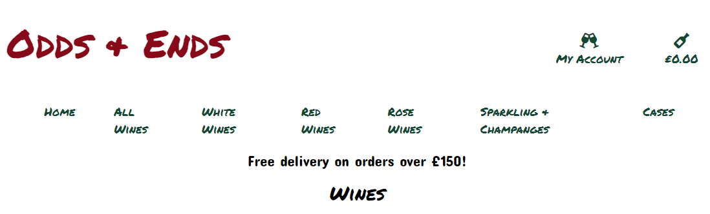
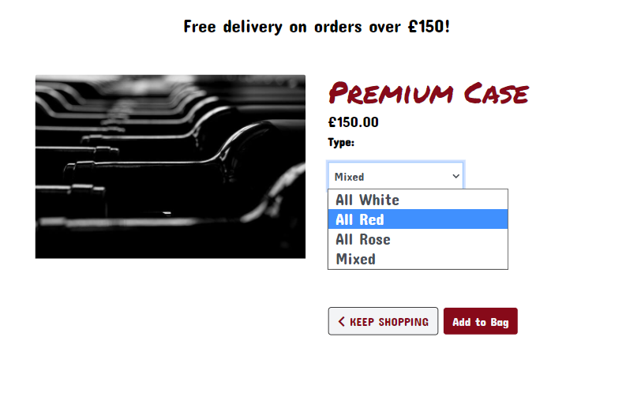

# Testing 
## Contents
  * [User Story Testing](#user-story-testing)
  * [Validator Testing](#validator-testing)
  * [Manual Testing](#manual-testing)
  * [Bugs Fixes](#bugs-fixes)
  * [Known Bugs](#known-bugs)

<small><i><a href='http://ecotrust-canada.github.io/markdown-toc/'>Table of contents generated with markdown-toc</a></i></small>

## User Story Testing 

#### As a site visitor, I want to be able to: 
- Understand the sites purpose at first glance.

The home page clearly layouts the sites name and purpose without user's having to search:

- View the wines on offer at that time.

There are clearly named links on the navigation bar that take user's to the wine's they wish to view:

- Know the prices of the cases on offer.

The three price points of cases is clearly displayed on the cases page:

- See the market value of each individual bottle of wine.

By accessing the wines page the user is able to view all wines or filter by their desired view:

- Filter wines by multiple options. 

User can filter directly from the navigation bar or from the wine page itself using the dropdown filter:

- See the number of results returned for each catergory.

When user view a specific colour of wine the number of wines in that colour category appears at the top left of the screen They are also provided with a link to take them back to all wines:
  

#### As a buyer, I want to be able to:
- Clearly see the purchase options available to me.

User are presented with the purchase options available to them by following the cases link on the the navigaiton bar or through the Buy Our Cases buttons present on both the Home Page and on every wine details page. Once the user has selected a case, the options for each case are presented to them in a drop down menu :
  
- Complete the checkout process without the requirement to create an account.

User's are not required to have an account to purchase but are invited to login or create an account to save their details and purchase history:

- View the selection in my bag to be purchased. 

Buyer's are able to access their bag at the top right of the screen and can access this at anytime, whether there are items there or not. If no items have been added, the user will see that the bag is empty:

- Add additonal cases to purchase or delete an exisiting case.

Using the quantity buttons (plus and minus) in the picture above, user's can easily adjust the number of cases they would like to order and update the bag using the update button. Orders for each case are limited to 10 and users can remove cases they do not want anymore by clicking the remove button.
- Easily enter payment details.

Unregistered user's are required to provide their delivery details and card information on one page to make a purchase. Registered user's can use the saved delivery details from their profiles:

- Know the payment process is safe and secure.

The site uses Stripe as the third party payment processor. Stripe is a well respected provider of this service for security and safety.
- View an order confirmation after checkout. 

Once a purchase had completed, the user receives a confirmation page on the site.

- Receive a confirmation email once the sale has completed.

As well as the on screen confirmatiom, user's also receive an email:

#### As a registered user, I want to be able to:
- Easily register for an account.

All user's can register for an account providing 3 pieces of information, an email, a username and a password. The email and username must unique and user's will be informed if either is already in use:

- Easily login and logout.

User can easily sign in with either their username or password and sign out by confirming they would like to sign out of the site:

- Reset my password. 

User's can reset their password by clicking on the Forgot Password link on the sign in page. They will be sent an email to follow a link to reset:

- Receive confirmation of registration.

User's are required to verify their email on registration and an email to allow them to do this is sent. Once verified, user's can then log in:

- View all my details and orders in my own profile.

Once registered, user's will be able to see their purchase history in their profile page:

- Update the details in my profile.

User's can update all of their default information directly from their profile by filling in the fields with the new information and clicking the Update Information button.

#### As a site owner, I want to be able to:
- Have administrator access directly through the site.

Site administrators can create, update and delete content directly through the frontend of the site.
- Add, edit or delete the wines in stock.

- Add, edit or delete the cases for sale.

- Be notified by email when customers or wineries make contact using the contact page.

Customer's and wineries are invited to contact the site admin and can do so using the site Contact page. User's are notified their email has been sent and Admin are notified by email when someone makes contact:

## Validator Testing 

## Manual Testing 

## Bugs Fixes

## Known Bugs 

